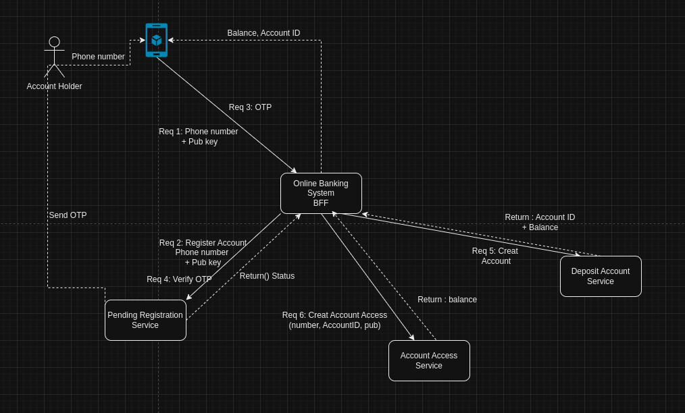
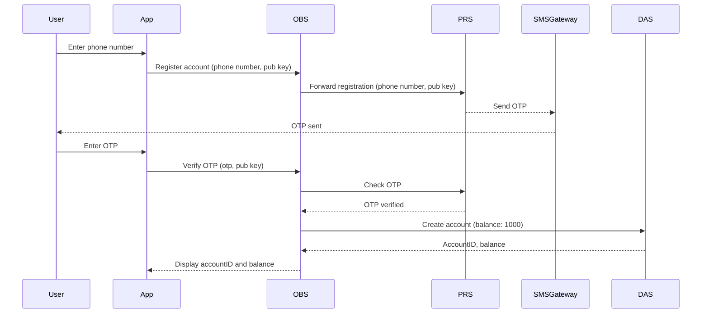

# **OBS Backend Architecture Documentation**

### **Table of Contents**
- [**OBS Backend Architecture Documentation**](#obs-backend-architecture-documentation)
    - [**Table of Contents**](#table-of-contents)
    - [**1. Introduction**](#1-introduction)
    - [**2. High-Level System Architecture**](#2-high-level-system-architecture)
    - [**3. OBS Interaction with other Modules**](#3-obs-interaction-with-other-modules)
      - [**3.1 OBS (Online Banking Service)**](#31-obs-online-banking-service)
      - [**3.2 PRS (Personal Registration Service)**](#32-prs-personal-registration-service)
      - [**3.3 DAS (Deposit Account Service)**](#33-das-deposit-account-service)
      - [**3.4 AAS (Account Access Service)**](#34-aas-account-access-service)
      - [**3.5 OBS Module Structure**](#35-obs-module-structure)
      - [**Why This Structure Was Chosen**](#why-this-structure-was-chosen)
    - [**4. API Design**](#4-api-design)
      - [**4.1 Endpoints Overview**](#41-endpoints-overview)
      - [**4.2 Payload Structure**](#42-payload-structure)
    - [**4.3 Error Handling**](#43-error-handling)
      - [**Key Error Types:**](#key-error-types)
    - [**5. Data Flow and Sequence Diagrams**](#5-data-flow-and-sequence-diagrams)
    - [**6. Security Considerations**](#6-security-considerations)
      - [**Key relationships**:](#key-relationships)
    - [**9. Conclusion**](#9-conclusion)

---

### **1. Introduction**
The **OBS (Online Banking Service)** is the backend service created with Springboot that handles user registration, OTP verification, and account management within the Webank system. It communicates with several core modules, including the **PRS (Personal Registration Service)**, **DAS (Deposit Account Service)**, and **AAS (Account Access Service)**, to manage user data, balance inquiries, and account creation.

**Goal of the OBS Module Architecture**

The goal of this architecture is to clearly define how the **OBS (Online Banking Service) module** interacts with other key backend components, detailing their communication patterns and collaborative workflows. Additionally, it outlines the structure of the OBS module, explaining the reasoning behind the architectural decisions, with a focus on ensuring efficient data flow, modularity, and scalability to support future growth and maintainability.


---

### **2. High-Level System Architecture**
The OBS system is part of a microservices architecture, designed to handle modular banking functionalities. Each service has its own responsibility, allowing for scalability, separation of concerns, and ease of maintenance.

- **Frontend (UserApp)** communicates via REST API with the OBS.
- **OBS** A module that Accept request and forwards requests to the appropriate backend modules.
- **Key Modules**: PRS, DAS, AAS, and SMS gateway.
- 


---

### **3. OBS Interaction with other Modules**

#### **3.1 OBS (Online Banking Service)**
The central hub that handles the flow of user requests. The OBS manages requests related to user registration and OTP verification and coordinates communication between the PRS, DAS, and AAS modules.

**Responsibilities:**
- Handle API requests from the frontend.
- Forward registration requests to PRS.
- Handle OTP verification by sending it to the PRS for validation.
- Forward account creation requests to DAS.
- Manage user sessions and balance queries.

#### **3.2 PRS (Personal Registration Service)**
Responsible for registering new users and verifying OTPs. It ensures that the user's phone number and public key are stored securely and validated correctly.

#### **3.3 DAS (Deposit Account Service)**
Handles account creation and management. When a registration request is approved, the DAS is responsible for creating a bank account and assigning an initial balance.

#### **3.4 AAS (Account Access Service)**
Manages access to user accounts, storing and managing the connection between user phone numbers, public keys, and account IDs.

#### **3.5 OBS Module Structure**
The OBS module consists of the following submodules, each responsible for handling user requests and coordinating interactions with other services:

1. **Online-Banking-REST-API**: 
   - **Purpose**: Exposes REST endpoints for online banking functionalities.
   - **Responsibilities**:
     - Receive incoming HTTP requests from the frontend.
     - Validate input data and route requests to the appropriate services (PRS, DAS, AAS).
     - Return responses to the frontend after processing.

2. **Online-Banking-REST-Server**: 
   - **Purpose**: Hosts the server for the REST API.
   - **Responsibilities**:
     - Listen for incoming API requests.
     - Manage server configurations and lifecycle events.
     - Handle routing to the appropriate REST API endpoints.

3. **Online-Banking-Service-API**: 
   - **Purpose**: Defines interfaces for online banking services.
   - **Responsibilities**:
     - Specify method signatures for operations such as user registration, account management, and OTP verification.
     - Ensure a consistent contract between the OBS and its module implementations.

4. **Online-Banking-Service-Impl**: 
   - **Purpose**: Implements the business logic defined in the Service API.
   - **Responsibilities**:
     - Execute operations like creating user accounts and processing transactions.
     - Interact with data access layers to perform CRUD operations.
     - Forward requests to relevant services (PRS, DAS, AAS) based on the operation requested.
     - Aggregate responses from these services and return them to the REST API layer.

#### **Why This Structure Was Chosen**

The structure of the OBS module was carefully designed to align with several key architectural principles:

1. **Modularity**:
   - By breaking the OBS into distinct submodules (REST API, REST Server, Service API, Service Implementation), we achieve a clear separation of concerns. Each module handles specific responsibilities, making it easier to manage and scale the application. This modularity allows for independent development, testing, and deployment of each component.

2. **Separation of Concerns**:
   - Each submodule is designed to focus on a particular aspect of the online banking functionality. For example, the Online-Banking-REST-API is dedicated to handling HTTP requests, while the Online-Banking-Service-Impl focuses on executing business logic. This separation allows developers to make changes or enhancements to one module without affecting others, reducing the risk of introducing bugs.

3. **Maintainability**:
   - A well-structured module architecture enhances maintainability. With clear interfaces defined in the Online-Banking-Service-API, developers can easily understand how to interact with the services. Additionally, changes to business logic can be implemented in the Service Implementation module without impacting the API layer.

4. **Flexibility**:
   - The structure allows for future enhancements and integrations with other services. For instance, if a new payment service needs to be added, it can be implemented as a new module with minimal impact on existing components.

5. **Improved Collaboration**:
   - The clear boundaries between modules facilitate collaboration among team members. Different developers or teams can work on different modules simultaneously, improving productivity and reducing conflicts.

Overall, this structure was chosen to create a robust, scalable, and maintainable online banking service that can adapt to future requirements while providing a seamless experience for users.

---

### **4. API Design**

#### **4.1 Endpoints Overview**
The following key API endpoints are exposed by the OBS to handle user registration and OTP verification.

| Method | Endpoint          | Description                             |
|--------|-------------------|-----------------------------------------|
| POST   | /register          | Accepts phone number and public key     |
| POST   | /verify-otp        | Verifies the OTP sent to the user       |
| GET    | /account/balance   | Fetches the user’s account balance      |

#### **4.2 Payload Structure**
Define the structure for API requests and responses. For example, for the registration endpoint:

**Registration Request Payload:**
```json
{
  "phoneNumber": "123456789",
  "publicKey": "generatedPublicKey"
}
OTP Verification Payload:

```json
{
  "otp": "123456",
  "publicKey": "userPublicKey"
}
```

### **4.3 Error Handling**
#### **Key Error Types:**
Error handling is essential to ensure users receive meaningful feedback when something goes wrong during the process. Standardized HTTP status codes, and descriptive messages are used to handle errors for various scenarios like failed registration and invalid OTPs.


1. **Registration Errors**:
   - **Invalid Phone Number**:
     - **HTTP Status**: `400 Bad Request`
     - **Message**: "Invalid or missing phone number."
   - **User Already Registered**:
     - **HTTP Status**: `409 Conflict`
     - **Message**: "User already registered."
   - **Public Key Generation Failure**:
     - **HTTP Status**: `500 Internal Server Error`
     - **Message**: "Error generating public key."

2. **OTP Verification Errors**:
   - **Invalid OTP**:
     - **HTTP Status**: `401 Unauthorized`
     - **Message**: "Invalid or expired OTP."
   - **OTP Expired**:
     - **HTTP Status**: `403 Forbidden`
     - **Message**: "OTP has expired."

### **5. Data Flow and Sequence Diagrams**
The sequence diagram demonstrates the interaction between OBS module and other components during the registration and OTP verification process.



### **6. Security Considerations**
- **Encryption**: All sensitive data, such as the public key and phone number, is encrypted in transit using HTTPS.
- **Authentication**: OTP verification ensures the authenticity of the user's phone number.
- **Key-Pair Cryptography**: Used to establish a secure link between the user and the server during registration.
- **Security best practices include**:
  - Data encryption for all sensitive fields.
  - Regular auditing and monitoring of API access logs.

#### **Key relationships**:
- Each user is linked to an account in the DAS.
- The OTP is temporarily stored in the PRS and removed after verification.
