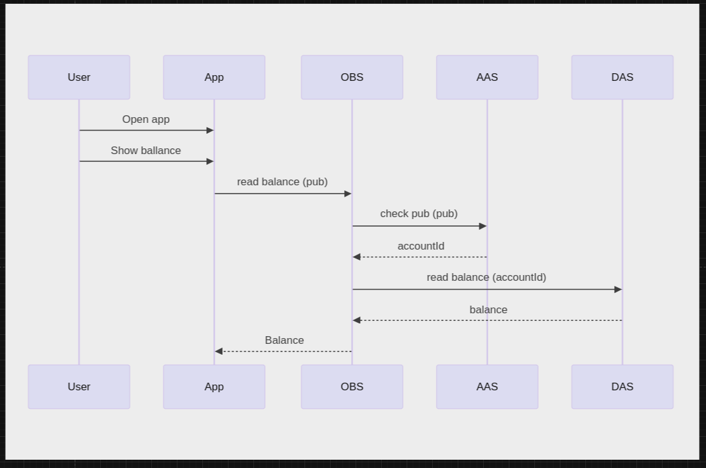

# **Deposit Account Service (DAS) - ARC42 Architecture Documentation**

---

### **Table of Contents**

1. [Introduction](#1-introduction)
2. [Architecture Constraints](#2-architecture-constraints)
3. [System Scope and Context](#3-system-scope-and-context)
4. [Solution Strategy](#4-solution-strategy)
5. [Building Block View](#5-building-block-view)
6. [Runtime View](#6-runtime-view)
7. [Deployment View](#7-deployment-view)
8. [Cross-cutting Concepts](#8-cross-cutting-concepts)
9. [Architecture Decisions](#9-architecture-decisions)
10. [Quality Requirements](#10-quality-requirements)
11. [Risks and Technical Debt](#11-risks-and-technical-debt)
12. [Product Management](#12-product-management)
13. [Glossary](#13-glossary)
14. [Appendix](#14-appendix)

---

## 1. Introduction

### Document Goals
This document provides a structured technical overview of the Deposit Account Service (DAS) using the ARC42 template. Its purpose is to support stakeholders, architects, and developers in understanding the architecture and design choices of the DAS module.

### Stakeholders
- **Product Managers**: Define functional and business requirements.
- **Development Teams**: Implement and maintain the service.
- **Security and Compliance Teams**: Ensure GDPR and regulatory compliance.
- **Operations**: Manage deployment, scalability, and monitoring.

---

## 2. Architecture Constraints

### Regulatory Constraints
- **GDPR Compliance**: Must ensure data privacy and protection for users.
- **Financial Regulations**: Must align with relevant financial regulatory standards for transaction handling and auditing.

### Technical Constraints
- **Data Encryption**: Sensitive data must be encrypted at rest and in transit.
- **Performance**: Must meet specific response time targets for balance inquiries and transaction history requests.

---

## 3. System Scope and Context

### Business Context
The Deposit Account Service (DAS) is a backend module within a financial ecosystem responsible for managing user accounts, balances, and transaction histories. It interfaces with the User Application, OBS (Online Banking Service), and AAS (Account Access Service).

### External Interfaces
- **User Interface**: Provides access for end-users to manage accounts and view balances.
- **Other Services**: Interfaces with OBS and AAS to handle tasks like balance inquiries and transaction retrievals.

---

## 4. Solution Strategy

DAS uses a layered architecture for clear separation of concerns, modularity, and scalability.

- **API Layer**: Exposes RESTful endpoints for external interactions.
- **Service Layer**: Processes business logic for account registration, balance inquiries, and transaction history.
- **Data Layer**: Manages data access, encryption, and storage.

---

## 5. Building Block View

### Overview
The DAS module is composed of three main components:
1. **Account Registration**: Manages account creation and data validation.
2. **Balance Inquiry**: Handles real-time balance retrieval.
3. **Transaction History**: Logs, retrieves, and filters transaction data.

### Detailed View
- **API Layer**: Communicates with users and other services.
- **Service Layer**: Contains business logic for account management.
- **Data Layer**: Manages interactions with the database for account and transaction data.

---

## 6. Runtime View

### Balance Inquiry Scenario
The balance inquiry process involves:
1. The **App** sends a balance request to **OBS**.
2. **OBS** validates the account with **AAS**.
3. **AAS** retrieves the account ID and forwards it to **DAS**.
4. **DAS** returns the balance through **AAS** and **OBS** to the **App**.

### Key Scenarios
- **Account Registration**: User initiates account creation, and the system validates, stores, and confirms data.
- **Transaction History Retrieval**: User requests a filtered transaction history, which DAS retrieves accordingly.

---

## 7. Deployment View

### Deployment Strategy
- **Cloud Infrastructure**: DAS is deployed with load balancing and horizontal scaling.
- **CI/CD Pipelines**: Enable automated deployment and updates.

---

## 8. Cross-cutting Concepts

### Security
- **Authentication and Authorization**: DAS uses secure methods for verifying user identity.
- **Data Encryption**: Sensitive data is encrypted at rest and in transit.
- **Access Control**: Role-based access is enforced for sensitive data.

### Performance Optimization
- Caching and indexing are used to improve response times for frequently accessed data, like balance and transaction history.

### Error Handling
- **Logging**: Errors are logged comprehensively for troubleshooting.
- **Alerts**: Real-time alerts are triggered for performance or security issues.

---

## 9. Architecture Decisions

### Key Decisions
- **Layered Architecture**: Supports modularity and separation of concerns.
- **RESTful API**: Ensures broad compatibility with external services.
- **Data Encryption**: Ensures security and regulatory compliance.
- **GDPR Compliance**: Guarantees secure handling and storage of user data.

---

## 10. Quality Requirements

### Functional Requirements
- **Account Registration**: Allows users to create and manage accounts.
- **Balance Inquiry**: Provides real-time balance access.
- **Transaction History**: Displays a user’s transaction history with filtering.

### Non-Functional Requirements
- **Performance**: Low-latency responses for balance and history requests.
- **Security**: Protects user data in compliance with GDPR.
- **Usability**: Provides a user-friendly API for integration.

---

## 11. Risks and Technical Debt

### Risks
- **Data Breach**: Protection of sensitive user data is critical to prevent unauthorized access.
- **Performance Bottlenecks**: Risk of slowdowns with high transaction volume.

### Technical Debt
- **Code Refactoring**: Service modules may require updates as DAS scales.
- **Legacy System Integration**: Integration with older systems may lead to maintenance challenges.

---

## 12. Product Management

### Overview
DAS is developed with Spring Boot, a robust framework for enterprise applications, to facilitate rapid development and seamless integration.

### Key Components
- **Spring Boot Starter**: Simplifies dependency management and configuration.
- **Spring Data JPA**: Manages data persistence and provides abstraction for database operations.
- **Spring Security**: Implements security protocols for authentication and authorization.
- **RESTful API**: Exposes endpoints for account operations.

### Configuration
- **Application Properties**: Configurations, such as database details and API properties, are stored in `application.properties` or `application.yml`.
- **Profiles**: Supports dev, test, and production profiles for environment-specific configurations.

### Build Tool
- **Maven/Gradle**: Manages dependencies, builds, and lifecycle processes.

### Testing
- **Unit Tests**: JUnit and Mockito test service and controller layers.
- **Integration Tests**: Spring Boot supports integration testing with embedded databases.

### Deployment
- **Docker**: Enables consistent deployment across environments.
- **Cloud Deployment**: Compatible with cloud platforms (e.g., AWS, Azure).

---

## 13. Glossary

- **DAS**: Deposit Account Service, manages user accounts.
- **OBS**: Online Banking Service, communicates with DAS for user requests.
- **AAS**: Account Access Service, validates accounts in balance inquiries.

---

## 14. Appendix

Additional documentation and supporting materials for DAS.
