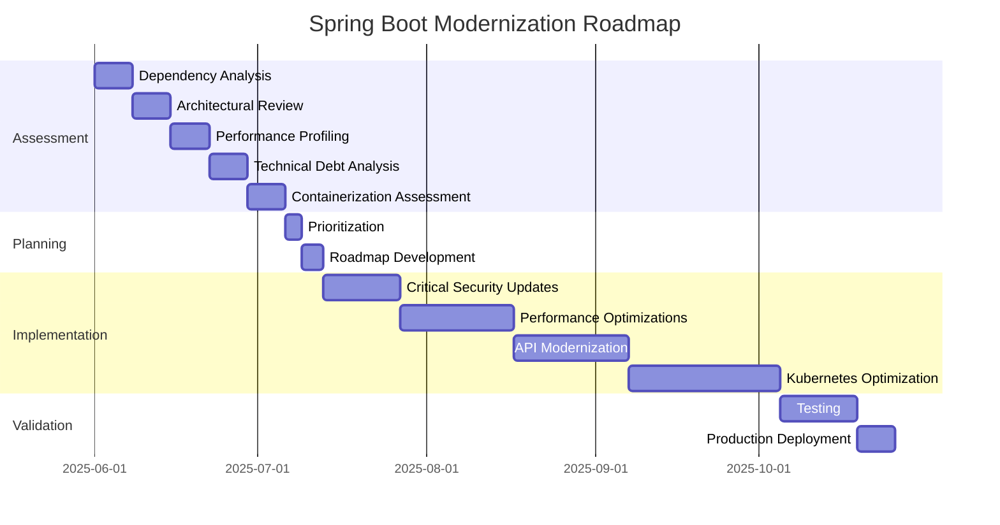

# Spring Boot Future-Proofing Assessment Plan (2025)

## Executive Summary

This document outlines a comprehensive plan for assessing the WeBank Online Banking application from a future-proofing perspective. The assessment will focus on identifying modernization opportunities, technical debt, and optimization strategies while maintaining the current blocking architecture. Special emphasis will be placed on containerization and Kubernetes deployment optimization.

## Current State Overview

Based on initial analysis, the WeBank Online Banking application:

- Is built on Spring Boot 3.3.5 with Java 17
- Follows a modular architecture with clear separation of concerns
- Uses traditional Spring MVC (not WebFlux) for REST endpoints
- Employs JPA with Hibernate for data persistence
- Implements security using JWT tokens and custom validation
- Is containerized using Docker with monitoring via Prometheus and Grafana

## Assessment Areas

### 1. Obsolete Dependencies Analysis

We will analyze all dependencies in the pom.xml files to identify:

- Dependencies that are outdated or approaching end-of-life
- Current industry-standard alternatives with metrics-driven comparison
- Migration complexity scores based on:
  - API compatibility
  - Required code changes
  - Testing complexity
  - Potential runtime impacts

**Methodology:**
- Automated dependency scanning using OWASP Dependency Check
- Manual review of critical dependencies
- Comparison against Spring Boot 3.x+ recommended dependencies
- Vulnerability assessment using CVE databases

**Deliverable:** Comprehensive dependency report with:
- Obsolescence risk score (1-10)
- Recommended alternatives
- Migration complexity score (1-10)
- Estimated effort for migration

### 2. Architectural Anti-Patterns Assessment

We will evaluate the codebase for architectural anti-patterns that undermine:

- Cloud-native principles
- Microservice resilience
- Maintainability and scalability

Specifically looking at:
- Service coupling and cohesion
- Configuration management
- State management
- Resilience patterns (circuit breakers, retries, etc.)
- Synchronous communication patterns and potential bottlenecks

**Methodology:**
- Static code analysis
- Architecture review sessions
- Pattern identification against cloud-native best practices
- Scalability assessment

**Deliverable:** Anti-pattern report with:
- Identified anti-patterns
- Impact assessment on scalability, resilience, and maintainability
- Recommended architectural improvements
- Before/after architecture diagrams

### 3. Runtime Efficiency Analysis

We will benchmark the application against Spring 3.x+ standards, focusing on:

- Response latency under various load conditions
- Memory footprint analysis
- Cold/warm startup times
- Resource utilization efficiency
- JVM optimization opportunities

**Methodology:**
- Load testing with JMeter
- Profiling with YourKit/VisualVM
- Memory analysis
- Startup time measurement
- Thread dump analysis

**Deliverable:** Performance profiling report with:
- Baseline metrics
- Comparison to industry benchmarks
- Hotspot identification
- Optimization recommendations with estimated impact

### 4. Technical Debt Quantification

We will use SonarQube metrics to quantify technical debt, including:

- Code quality issues
- Test coverage gaps
- Duplication
- Complexity
- Security vulnerabilities

**Methodology:**
- SonarQube analysis
- Manual code review
- Test coverage assessment
- Complexity metrics calculation

**Deliverable:** Technical debt report with:
- Overall debt quantification
- Priority-ranked refactoring candidates
- Maintenance impact scores
- Remediation plan with effort estimates

### 5. Data Access Layer Optimization

We will analyze the current data access approach and recommend:

- Strategic caching policies
- Connection pool configurations
- Query optimization strategies
- Batch processing improvements
- Transaction management optimization

**Methodology:**
- Database query analysis
- Connection pool configuration review
- Cache hit/miss ratio assessment
- Transaction boundary review

**Deliverable:** Data access optimization plan with:
- Current vs. optimized approach comparison
- Implementation roadmap
- Performance impact projections
- Code examples for key optimizations

### 6. Spring Boot 3.x+ Compliance Assessment

We will evaluate compliance with Spring Boot 3.x+ conventions, including:

- Component structure
- Configuration approaches
- Dependency injection patterns
- Lifecycle management
- Testing practices

**Methodology:**
- Code structure analysis
- Configuration review
- Comparison against Spring Boot 3.x+ best practices
- Identification of deprecated patterns

**Deliverable:** Compliance report with:
- Compliance score by category
- Non-standard implementations
- Modernization recommendations
- Migration path with effort estimates

### 7. Containerization and Kubernetes Optimization

We will perform a detailed assessment of the current containerization approach and provide recommendations for Kubernetes optimization:

#### 7.1 Container Optimization

- Image size reduction strategies
- Multi-stage build implementation
- Base image security and efficiency
- Resource allocation and limits
- Startup time optimization
- Health check implementation
- Graceful shutdown handling

#### 7.2 Kubernetes Deployment Optimization

- Pod resource specifications (requests and limits)
- Horizontal Pod Autoscaling (HPA) configuration
- Liveness and readiness probe optimization
- Init container usage
- ConfigMap and Secret management
- StatefulSet vs Deployment considerations
- Network policy implementation
- Service mesh integration opportunities
- Persistent volume management
- Backup and disaster recovery strategies

#### 7.3 CI/CD Pipeline for Kubernetes

- GitOps workflow implementation
- Helm chart development
- Kustomize configuration
- Blue/green and canary deployment strategies
- Automated testing in Kubernetes environment
- Secrets management in CI/CD

**Methodology:**
- Docker image analysis
- Kubernetes manifest review
- Resource utilization monitoring
- Deployment strategy assessment
- Security scanning of container images
- CI/CD pipeline review

**Deliverable:** Containerization and Kubernetes optimization report with:
- Current state assessment
- Optimization recommendations with before/after examples
- Security enhancement strategies
- Resource efficiency improvements
- Implementation roadmap with effort estimates
- Helm chart templates or Kustomize configurations

### 8. API Maturity Assessment

We will evaluate the API against:

- OpenAPI 3.1 standards
- Hypermedia compliance
- Versioning strategies
- Documentation completeness

**Methodology:**
- API contract review
- Documentation assessment
- Client usage analysis
- Versioning strategy evaluation

**Deliverable:** API maturity report with:
- Maturity score by category
- Gap analysis
- Enhancement recommendations
- Implementation examples

### 9. Security Posture Evaluation

We will assess the security implementation against:

- NIST 800-53 Rev.5 controls
- Modern OAuth 2.1/OIDC workflows
- Zero-trust implementation patterns
- Security testing practices

**Methodology:**
- Security control mapping
- Authentication flow review
- Authorization mechanism assessment
- Penetration testing
- Dependency vulnerability scanning

**Deliverable:** Security posture report with:
- Compliance assessment
- Vulnerability analysis
- Remediation recommendations
- Implementation guidance

### 10. Developer Experience Enhancements

We will recommend improvements for:

- Spring Shell automation opportunities
- Containerized development environments
- Test-driven metrics
- CI/CD pipeline optimizations

**Methodology:**
- Developer workflow analysis
- Build time measurement
- Test execution time assessment
- Local development environment review

**Deliverable:** Developer experience enhancement plan with:
- Current vs. enhanced workflow comparison
- Implementation guidance
- Productivity impact assessment
- Tool recommendations

## Implementation Approach

For each area, we will provide:

1. **Detailed Analysis:** Current state assessment with metrics and examples
2. **Before/After Code Snippets:** Concrete examples of recommended changes
3. **Implementation Roadmap:** Phased approach with effort estimates
4. **Migration Strategies:** Balancing innovation with business continuity

## Timeline and Effort Estimation

## Risk Assessment and Mitigation

| Risk | Impact | Probability | Mitigation Strategy |
|------|--------|-------------|---------------------|
| Service disruption during migration | High | Medium | Comprehensive testing, blue/green deployment |
| Performance regression | Medium | Medium | Baseline performance metrics, automated performance testing |
| Security vulnerabilities | High | Low | Regular security scanning, SAST/DAST integration |
| Knowledge gaps | Medium | Medium | Documentation, knowledge transfer sessions |
| Scope creep | Medium | High | Clear prioritization, phased approach |

## Conclusion

This assessment plan provides a comprehensive approach to future-proofing the WeBank Online Banking application while maintaining its current blocking architecture. Special emphasis has been placed on containerization and Kubernetes deployment optimization to ensure cloud-native readiness.

The assessment will deliver actionable insights with concrete implementation guidance, allowing for a phased modernization approach that balances innovation with business continuity.