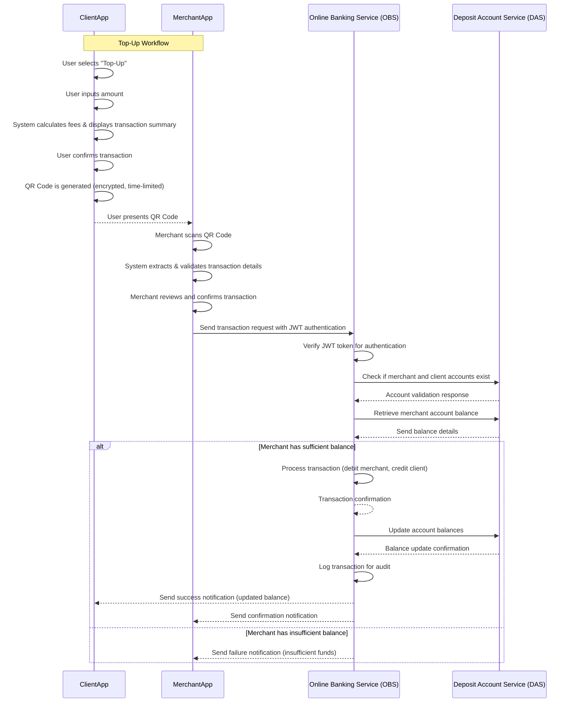

# Requirement Document for the Top-Up Functionality

## Table of Contents
1. [Introduction](#1-introduction)
2. [High-Level System Architecture](#2-high-level-system-architecture)
3. [Top-Up Workflow](#3-top-up-workflow)  
   3.1. [Client Top-Up Request](#31-client-top-up-request)  
   3.2. [QR Code Generation](#32-qr-code-generation)  
   3.3. [Merchant QR Code Scanning](#33-merchant-qr-code-scanning)  
   3.4. [Transaction Confirmation](#34-transaction-confirmation)
5. [Security Considerations](#5-security-considerations)  
   5.1. [QR Code Data Security](#51-qr-code-data-security)  
   5.2. [API Authentication and Authorization](#52-api-authentication-and-authorization)  
   5.3. [Transaction Verification](#53-transaction-verification)
6. [Caching Mechanisms](#6-caching-mechanisms)  
   6.1. [Transaction Data Cache](#61-transaction-data-cache)  
   6.2. [Notification Cache](#62-notification-cache)
7. [Error Handling](#7-error-handling)
8. [Scalability](#8-scalability)
9. [Sequence Diagrams](#9-sequence-diagrams)
10. [Glossary of Terms](#10-glossary-of-terms)
11. [Version History](#11-version-history)
12. [Conclusion](#12-conclusion)

## 1. Introduction
The **Top-Up Functionality** is a critical component of the **Webank system**, enabling users to securely deposit funds into their accounts through a streamlined, **QR code-based transaction process**. This Functionality ensures **fast, secure, and user-friendly** top-ups while integrating seamlessly with the **Online Banking Service (OBS)** and other key banking subsystems.

The **Top-Up Functionality** is designed to support multiple use cases, including **agent-assisted top-ups**, making it a **versatile financial feature** that enhances the user experience and promotes financial inclusion.

### **Key Responsibilities and Enhancements:**

- **QR Code Implementation:**  
  The Functionality uses **dynamically generated QR codes** for transaction requests. This allows users to generate a **secure, time-sensitive QR code** that merchants or agents can scan to process top-ups efficiently. QR codes encode transaction details such as **account ID, top-up amount, and unique identifiers** to prevent fraud and misuse.

- **Seamless Integration with OBS & DAS:**  
  The Functionality **directly interacts** with the **Online Banking Service (OBS)** to process transactions and validate account details. Additionally, it connects with the **Deposit Account Service (DAS)** to **update account balances** once a transaction is confirmed.

- **Secure Transaction Processing:**
    - Transactions require **authentication** via API security mechanisms such as **JWT tokens**.
    - The Functionality **verifies** the sender and recipient accounts before processing the transaction.
    - **Fraud prevention measures** include limits on the maximum top-up amount and real-time validation of user activity.

- **Real-Time Notifications via PWA:**  
  Users receive **instant notifications** via the **Progressive Web App (PWA)** once a top-up is completed. This ensures **transparency** and allows users to track their **transaction history** without delays.

## 2. High-Level System Architecture

The **Top-Up Functionality** operates as a **microservice** within the Webank ecosystem, facilitating seamless and secure account deposits. It interacts with several critical banking services, ensuring **efficient, scalable, and secure** transaction processing.

### **System Components and Interactions**

The Top-Up Functionality communicates with the following key systems:

1. **UserApp (Mobile Application):**
    - The primary interface for customers to initiate top-up transactions.
    - Generates **QR codes** for transactions and scans merchant/agent QR codes for processing.
    - Displays **real-time transaction status updates** and **notifications**.

2. **Online Banking Service (OBS):**
    - Handles **user authentication** and **authorization** before processing transactions.
    - Manages **user account validation** to ensure that the top-up is linked to an active account.
    - Provides transaction history and real-time status updates to the UserApp.

3. **Deposit Account Service (DAS):**
    - Responsible for maintaining **account balances** and processing **fund deposits**.
    - Ensures **fund availability** before committing the transaction.
    - Logs all top-up activities for **audit and reconciliation** purposes.

### **Architectural Principles**

The **Top-Up Functionality** follows key architectural principles to ensure security, scalability, and maintainability:

- **Security:** Ensures encrypted communication, secure authentication, and fraud prevention mechanisms.
- **Scalability:** Designed to handle high transaction volumes with efficient resource allocation.
- **Availability:** Implements failover strategies and load balancing for minimal downtime.
- **Maintainability:** Follows a modular microservice architecture for ease of updates and debugging.
- **Extensibility:** Supports seamless integration of future enhancements and new features.

### **High-Level System Flow**

1. **User initiates a top-up via the UserApp.**
2. **The UserApp generates a QR code** containing transaction details.
3. **The merchant/agent scans the QR code**, validating the transaction with OBS.
4. **OBS authorizes the transaction** and forwards it to DAS for balance updates.
5. **DAS processes the top-up, updating the user’s account balance.**
6. **The UserApp receives a real-time notification of a successful top-up.**

This architecture ensures that the **Top-Up Functionality** remains **secure, scalable, and resilient**, delivering a **seamless banking experience** for users.

## 3. Top-Up Workflow

The **Top-Up Workflow** facilitates secure and seamless fund deposits into a user's account via QR code-based transactions. It consists of four key steps: **Client Top-Up Request, QR Code Generation, Merchant QR Code Scanning, and Transaction Confirmation.**

### **3.1. Client Top-Up Request**
1. **User Initiates a Top-Up:**
    * The user selects the **"Top-Up"** option in the **UserApp**.
    * They input the **amount to deposit**, and the system calculates applicable **fees**.
2. **Transaction Summary Display:**
    * The app displays the **transaction details**, including:
        - **Deposit amount**
        - **Applicable fees**
        - **Total amount payable**
    * The user can either **cancel** or **confirm** the transaction.

### **3.2. QR Code Generation**
1. **QR Code Creation:**
    * Upon confirmation, the system generates a **QR code** embedded with:
        - **client account ID**
        - **Top-Up amount**
        - **Transaction metadata** (e.g., timestamp, transaction ID)
2. **Security Measures:**
    * The QR code is **securely encrypted** and **time-limited** to prevent reuse or fraudulent scans.
3. **QR Code Display:**
    * The user presents the **generated QR code** to the merchant for scanning.

### **3.3. Merchant QR Code Scanning**
1. **Merchant Initiates Scan:**
    * The user selects the **"AGENT"** option in the **UserApp**.
    * Then selects **"Collect Payment"**.
    * The built-in QR scanner reads the **client’s QR code**.
2. **Transaction Extraction & Validation:**
    * The system extracts and **verifies**:
        - **Destination account ID**
        - **Top-Up amount**
        - **QR code expiration**
    * If the QR code is **invalid or expired**, an error message is displayed.

### **3.4. Transaction Confirmation**
1. **Merchant Reviews Transaction Details:**
    * The merchant reviews the extracted **transaction details** before proceeding.
    * JWT Header: Contains the device's public key.
      JWT Body: Contains:
        ClientAccountID : The Account id Extracted from the QR code
        MarchantAccountID : The account Id of the marchant
        Amount: Amount to send
      JWT Signature: The JWT is signed using the device's private key.

2. **Transaction Processing:**
    * If the details are correct, the merchant presses **"Confirm"**.
    * The backend system performs the following steps:
        - **Authenticate the request:** Verifies the JWT token to ensure the request is legitimate.
        - **Validate account existence:** Checks if both the **merchant’s account** and the **client’s account** exist in the **Deposit Account Service (DAS)**.
        - **Verify merchant balance:** Ensures the merchant's account has sufficient funds to process the top-up.
        - **Validate transaction details:** Confirms that the transaction amount, currency, and other parameters match the expected values.
        - **Process the transaction:** Initiates the fund transfer through the **Online Banking Service (OBS)**.
        - **Update balances:** Deducts the amount from the merchant's account and credits the client’s account.
        - **Log the transaction:** Records the transaction details for audit and reconciliation purposes.
        - **Return response:** Sends a confirmation response to the merchant and client, indicating success or failure.

3. **Real-Time Notifications:**
    * A **success notification** is sent to:
        - The **user**, confirming the top-up.
        - The **merchant**, verifying successful fund transfer.
    * The updated **account balance** is displayed in the **UserApp**.

### **Data Flow Diagram:**

## 5. Security Considerations

### **5.1. QR Code Data Security**
- **Encryption:** All QR codes used in transactions are encrypted to ensure that sensitive information, such as transaction details and amounts, is securely transmitted. This prevents unauthorized access or tampering.
- **Expiration:** Each QR code is time-limited, expiring after a short period. This helps to prevent replay attacks or the reuse of QR codes after a transaction window has passed, enhancing the security of each transaction.

### **5.2. API Authentication and Authorization**
- **JWT Tokens:** The system utilizes **JSON Web Tokens (JWT)** for secure API access. JWT tokens are used to authenticate users and verify the validity of their requests. These tokens ensure that each request to the API is from a valid user or service.
- **Two-Factor Authentication (2FA):** To provide an additional layer of security, transactions require **two-factor authentication**. Users must authenticate via a second factor (e.g., OTP sent via SMS or email) to confirm their identity before a transaction is processed.

### **5.3. Transaction Verification**
- **Transaction Logging:** All transactions are logged in the system to maintain an auditable trail. This ensures that any discrepancies or fraudulent activities can be traced back and investigated thoroughly.
- **Real-time Notifications:** Users are sent **real-time notifications** after each transaction, including confirmation or failure alerts. This ensures that users are always aware of their account activities and can take immediate action if they notice any suspicious transactions.

---

## **6. Caching Mechanisms**

### **6.1. Transaction Data Cache**
- **Quick Lookup:** The system stores recent transaction data in a **transaction cache** to enable fast retrieval of transaction history and status. This improves user experience by reducing latency when accessing recent transactions.
- **Time-based Expiry:** Transaction data in the cache expires after a short period to ensure that the cache remains up-to-date and accurate, minimizing the risk of displaying outdated information.

### **6.2. Notification Cache**
- **Efficient Message Delivery:** The **notification cache** is used to manage messages sent to users. It ensures that notifications are delivered promptly, even under high load conditions, by caching and batching notifications for efficient processing.
- **Message Queueing:** If a notification cannot be delivered due to network issues or temporary server overload, it is queued for retry, ensuring that no messages are lost.

## **7. Error Handling**
### **Invalid QR Code Error Handling**
- **Expired QR Code:**
    - QR code has exceeded its time validity.
    - System displays an error message informing the user the QR code has expired.
    - User is prompted to generate a new valid QR code.

- **Tampered or Invalid QR Code Format:**
    - QR code is corrupted or does not meet the expected format.
    - System detects the invalid structure or corrupted data.
    - Error message is shown: "QR Code is corrupted or invalid."
    - User is asked to regenerate a valid QR code.

- **Incorrect Transaction Details in QR Code:**
    - QR code contains inconsistent or incorrect transaction details (e.g., wrong amount or recipient).
    - System validates the extracted data against internal records.
    - Error message is displayed if the details are mismatched.
    - User is prompted to verify the details and generate a new QR code.

- **Unauthorized QR Code Use:**
    - QR code is suspected to be forged, intercepted, or unauthorized.
    - System checks for authenticity and legitimacy of the QR code.
    - If the QR code cannot be validated, an error message is shown.
    - User is instructed to re-authenticate or verify their identity.

### **Insufficient Balance Error Handling**
- **Insufficient Funds:**
    - User does not have enough funds to complete the transaction.
    - System checks the account balance before proceeding.
    - If balance is insufficient, the transaction is blocked.
    - An error message is displayed: "Insufficient balance to complete the transaction."
    - User is notified and asked to fund their account or adjust the transaction amount.

### **Network Failure Error Handling**
- **Network Disconnection:**
    - A failure in the network or communication issues occur during the transaction process.
    - System detects the loss of connectivity.
    - Transaction is **queued** and not discarded, ensuring no data loss.
    - Error message is displayed: "Network failure. Your transaction is queued and will be retried once the connection is restored."
    - Once network is restored, the transaction is **automatically retried**.
    - User is notified when the transaction has been successfully processed after retry.

## **8. Scalability**
- **Load Balancers:** **Load balancers** are used to distribute incoming API requests evenly across multiple servers, ensuring that no single server is overwhelmed with traffic. This helps in maintaining high availability and performance under heavy loads.
- **Microservices Architecture:** The system follows a **microservices architecture**, allowing each component to scale independently based on demand. This modular approach makes it easier to scale specific services, like transaction processing or user management, without affecting the rest of the system.

## 10. Glossary of Terms

- **OBS (Online Banking Service):** Manages user transactions, account validation, and interaction with DAS for secure processing of banking requests.
- **DAS (Deposit Account Service):** Handles user account balances, account creation, and updates based on transactions processed by OBS.
- **QR Code:** An encrypted, time-limited 2D barcode used for secure transaction details and authentication. Invalid or expired QR codes trigger an error.
- **JWT (JSON Web Token):** A URL-safe token for secure API authentication, verifying the authenticity of requests between client, merchant, and backend services.
- **Two-Factor Authentication (2FA):** A security method requiring two forms of identification to authenticate a user (e.g., password + OTP or biometric verification).

## 11. Version History

| Version | Date       | Changes         | Author |
|---------|------------|-----------------|--------|
| 1.0     | 2025-02-14 | Initial version | Tchikaya Ariel |

## 12. Conclusion
This document outlines the **design, security, and workflow** of the **Top-Up Functionality**. It ensures a **seamless and secure experience** for both clients and merchants.